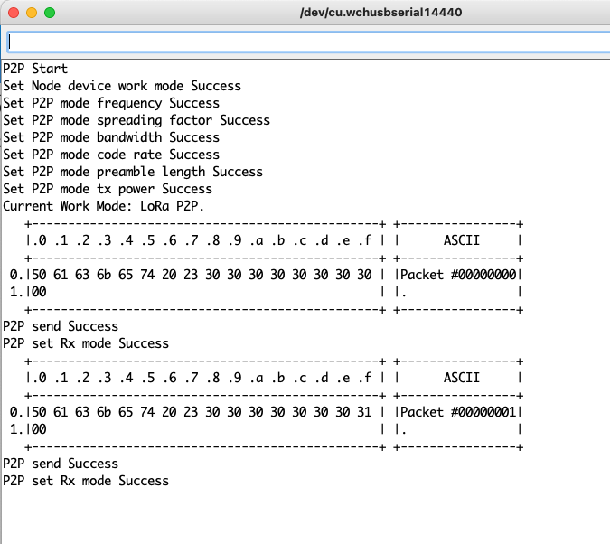
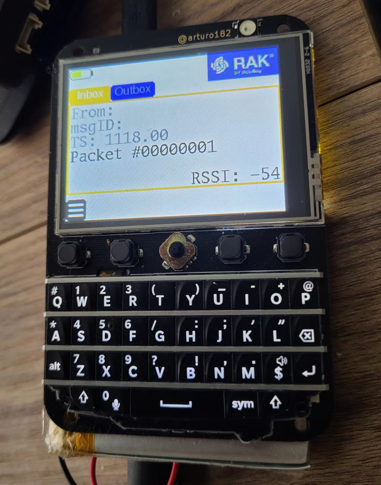
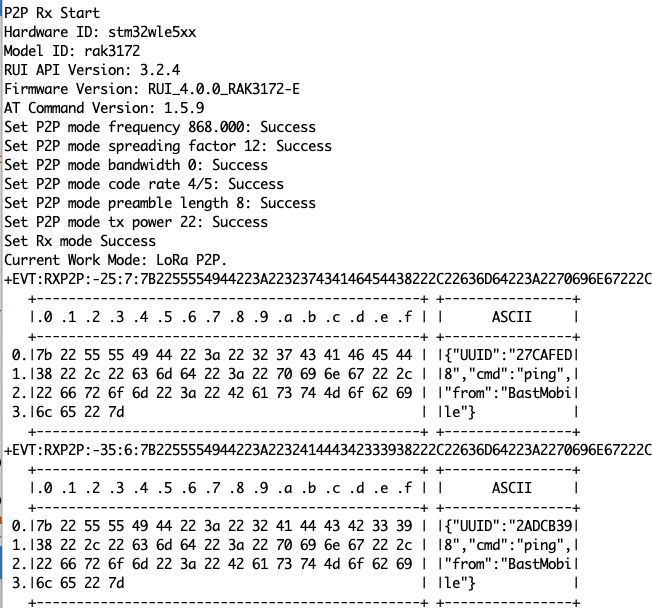

# RUI3_LoRa_Basic_Rx_Tx

A set of 2 basic exemples showing how to do LoRa Rx/Tx in RUI3. Following a thread in [the RAK forum](https://forum.rakwireless.com/t/rak3172-communication/8972), where a user had difficulties setting up a simple LoRa Rx/Tx example, I realized that my example was maybe a little too smart for its own good: it is using timeouts in the receive function to call a callback, and start sending. Yeah, I know...

ANYWAY. I rewrote that as a more classic set of two examples, Rx and Tx. Workie workie muchie bettersky.

*RAK3172 sends.*

*Roger roger! The Bastwan has received the Tx from RAK3172.*

*RAK3172 receives a packet from my Bastwan.*
